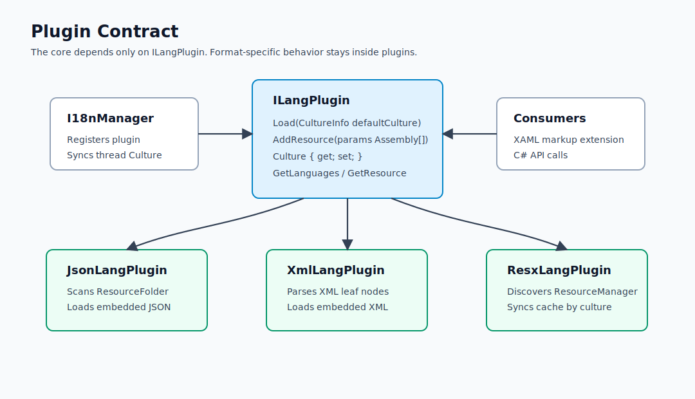
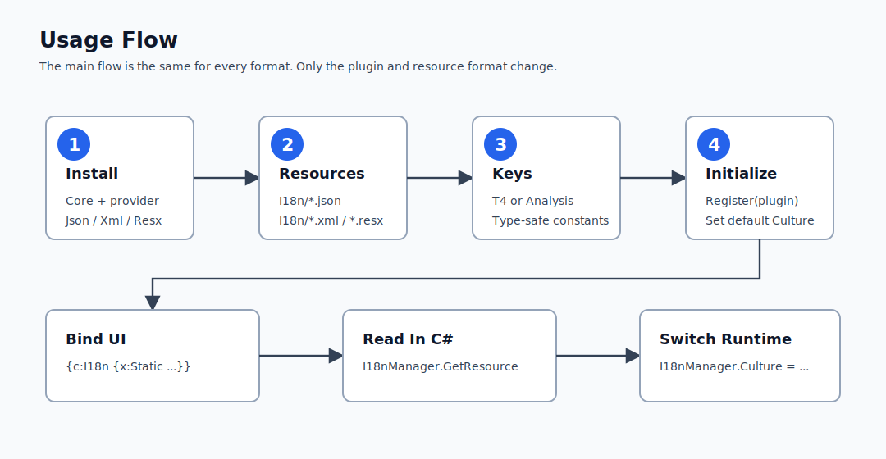
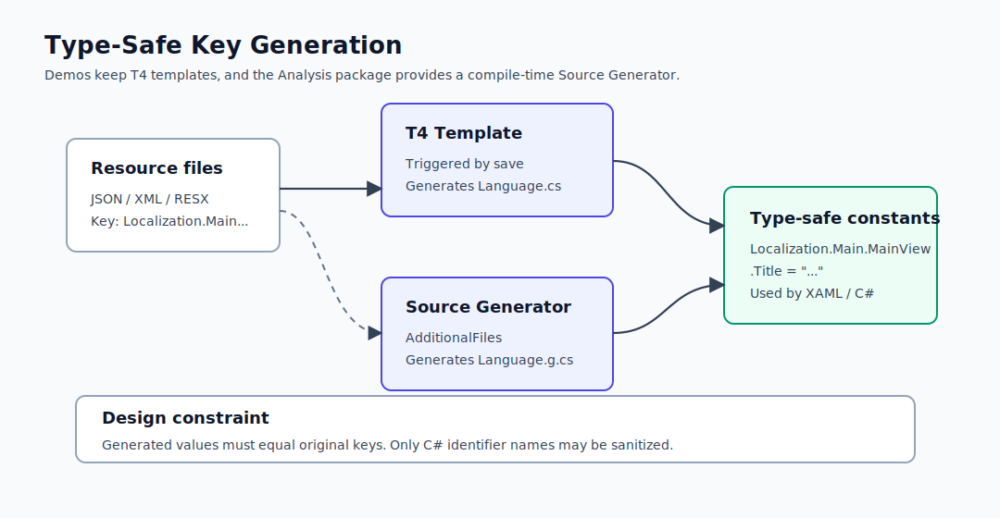

# Lang.Avalonia Design Document

[简体中文](design.md) | English

This document describes the architecture, resource loading, runtime resolution flow, and demo organization of Lang.Avalonia. Diagrams are stored as standalone SVG files under `docs/assets` so they can be reused in README files, NuGet documentation, or documentation sites.

## Goals

Lang.Avalonia provides a unified localization entry point for Avalonia applications: XAML uses the `{c:I18n}` markup extension, C# uses `I18nManager.Instance.GetResource`, and the resource format is selected by the plugin. The core library does not care whether resources come from JSON, XML, or RESX. It only depends on `ILangPlugin`.


## Packages And Responsibilities

| Package | Responsibility |
| --- | --- |
| `Lang.Avalonia` | Markup extension, binding pipeline, converters, `I18nManager`, plugin contract |
| `Lang.Avalonia.Json` | Loads JSON language files or embedded JSON resources |
| `Lang.Avalonia.Xml` | Loads XML language files or embedded XML resources |
| `Lang.Avalonia.Resx` | Synchronizes RESX resources through `ResourceManager` |
| `Lang.Avalonia.Analysis` | Scans language files at compile time and generates type-safe keys |

## Plugin Contract

Plugins implement `ILangPlugin` and normalize language resources from different sources into `LocalizationLanguage` caches. The core library calls `Load` to initialize the default language, uses `Culture` to switch languages, and calls `GetResource` to resolve translated text.



Key constraints:

1. `Load(defaultCulture)` should set the default language and build the resource cache.
2. `AddResource(assemblies)` should append resources from external modules. JSON/XML plugins can read embedded resources, and the RESX plugin discovers `ResourceManager` from assembly types.
3. `GetResource(key, cultureName)` should use the explicit culture first; if it is not provided, use the current culture; then fall back to the default culture; if still missing, return the original key.

## Usage Flow

Consumers choose a resource format and install the corresponding plugin, create language resources, generate type-safe keys, register the plugin in `App.Initialize`, and then read resources from XAML or C#.



Typical initialization:

```csharp
I18nManager.Instance.Register(new JsonLangPlugin(), new CultureInfo("zh-CN"), out var error);
if (error != null)
{
    // Log or show the initialization error.
}
```

Typical XAML:

```xml
<SelectableTextBlock Text="{c:I18n {x:Static mainLangs:MainView.Title}}" />
<SelectableTextBlock Text="{c:I18n {x:Static mainLangs:MainView.Title}, CultureName=en-US}" />
```

Typical C# call:

```csharp
var title = I18nManager.Instance.GetResource(Localization.Main.MainView.Title);
var titleEnUs = I18nManager.Instance.GetResource(Localization.Main.MainView.Title, "en-US");
```

## Resource Resolution

`I18nConverter` listens to `I18nManager.Culture`. When the language changes, bindings are re-evaluated and resources are resolved through the active plugin. Text with arguments uses `string.Format(culture, format, args)`. If binding arguments are not ready, the current value is kept to avoid startup binding exceptions.


Fallback order:

1. Explicit `CultureName`, or `I18nManager.Culture` when omitted.
2. The default culture passed during initialization.
3. The original resource key.

## Type-Safe Key Generation

The project supports two paths for generating type-safe keys: T4 templates in demo projects and the `Lang.Avalonia.Analysis` Source Generator. Field names may be sanitized to produce valid C# identifiers, but field values must preserve the original resource keys or runtime lookup will fail.



Source Generator inputs come from `AdditionalFiles`:

```xml
<AdditionalFiles Include="I18n\*.json" />
```

Generated keys are used from XAML:

```xml
<SelectableTextBlock Text="{c:I18n {x:Static mainLangs:MainView.ChangeLanguage}}" />
```

## Demo Projects

| Demo | Description |
| --- | --- |
| `Lang.Avalonia.Json.Demo` | JSON files are copied to the output directory and loaded by the plugin |
| `Lang.Avalonia.Xml.Demo` | XML files are copied to the output directory and loaded by the plugin |
| `Lang.Avalonia.Resx.Demo` | RESX files are compiled into assembly resources and read through `ResourceManager` |
| `Lang.Avalonia.Analysis.Demo` | Uses `Lang.Avalonia.Analysis` to generate keys at compile time |

Demo ViewModels use non-null language lists and switch `I18nManager.Instance.Culture` only after validating the selected language. This avoids null references when resources are not loaded or the ComboBox selection is cleared.

## Runtime Notes

1. JSON/XML plugins scan `AppDomain.CurrentDomain.BaseDirectory` by default. Demo projects copy language files through `CopyToOutputDirectory`.
2. The RESX plugin filters resource types by `Mark`; the default value is `i18n`, so resource namespaces should include this marker or set `Mark` explicitly.
3. `I18nManager.Register` synchronizes the current thread culture and the default thread culture, so newly created background threads inherit the default culture.
4. Dynamic key binding depends on Avalonia `Binding`; trimmed applications should still pay attention to Avalonia reflection-binding trim warnings.
