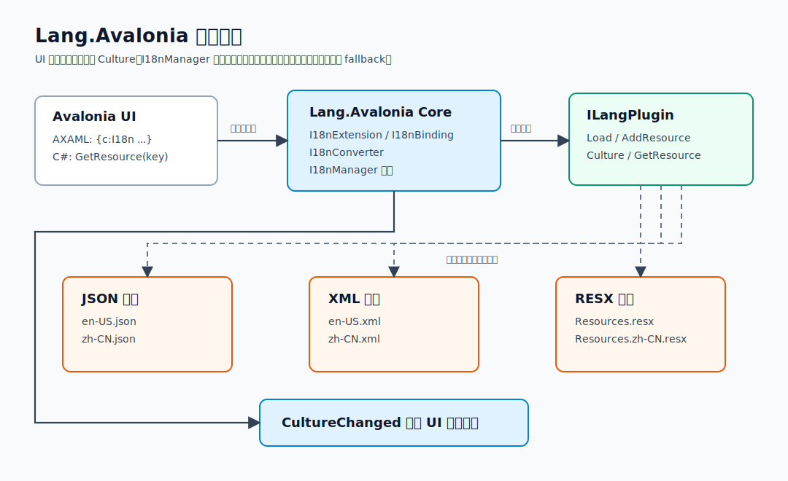
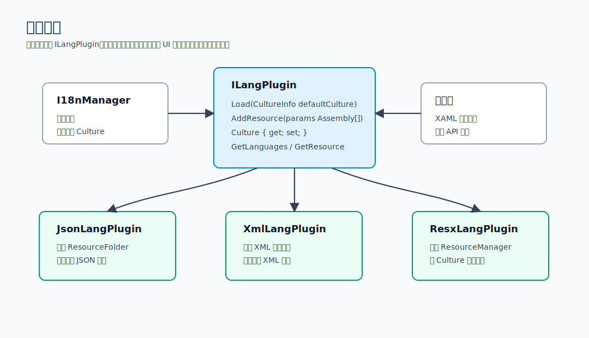
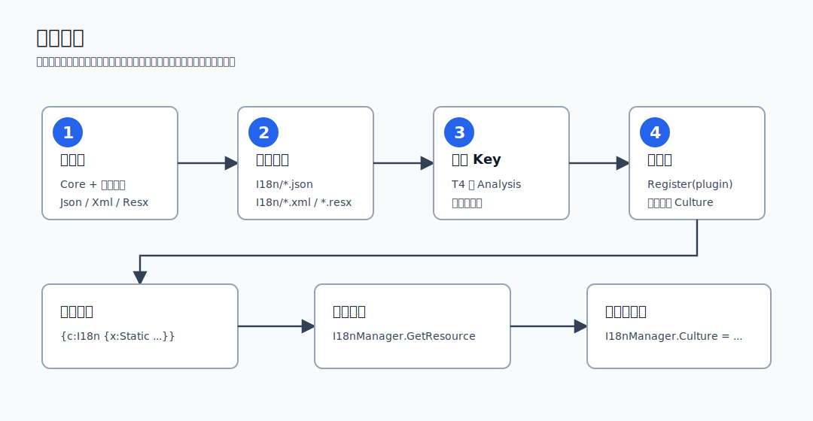
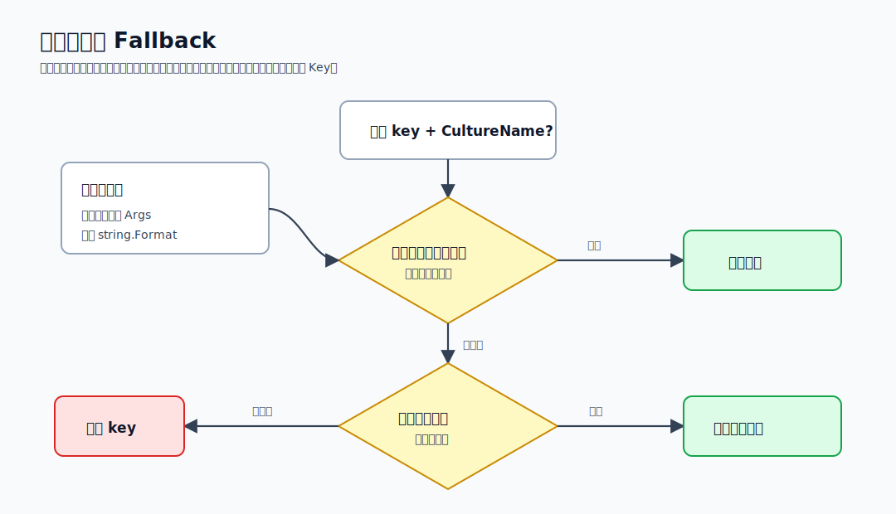

# Lang.Avalonia 技术说明与设计文档


本文档面向维护者和集成方，合并说明 Lang.Avalonia 的设计目标、核心类型、插件契约、资源加载、运行时解析流程和示例项目组织方式。快速上手请先看 [README.md](../README.md)。文中的图示均以独立 SVG 文件存放在 `docs/assets`，方便在 README、NuGet 文档或站点中复用。

## 设计目标

Lang.Avalonia 在 Avalonia 应用中提供统一的多语言入口：XAML 使用 `{c:I18n}` 标记扩展，C# 使用 `I18nManager.Instance.GetResource`，资源格式由插件决定。核心库不关心资源来自 JSON、XML 还是 RESX，只依赖 `ILangPlugin`。

整体设计拆成两层：

1. `Lang.Avalonia` 核心库负责 XAML 标记扩展、绑定刷新、格式化和文化切换。
2. JSON、XML、RESX 插件负责把不同来源的资源归一化为 `LocalizationLanguage` 字典。

这种设计避免 UI、ViewModel 和业务代码关心资源文件格式。使用方只需要注册一个 `ILangPlugin`，之后都通过 `{c:I18n}` 或 `I18nManager.Instance.GetResource` 读取文本。



## 包与核心类型

| 包 | 职责 |
| --- | --- |
| `Lang.Avalonia` | 标记扩展、绑定、转换器、`I18nManager`、插件接口 |
| `Lang.Avalonia.Json` | 加载 JSON 语言文件或嵌入 JSON 资源 |
| `Lang.Avalonia.Xml` | 加载 XML 语言文件或嵌入 XML 资源 |
| `Lang.Avalonia.Resx` | 从 `ResourceManager` 同步 RESX 资源 |
| `Lang.Avalonia.Analysis` | 编译期扫描语言文件并生成强类型 Key |

| 类型 | 所属包 | 作用 |
| --- | --- | --- |
| `I18nManager` | `Lang.Avalonia` | 全局运行时入口，负责注册插件、切换 Culture、触发绑定刷新 |
| `I18nExtension` | `Lang.Avalonia` | AXAML 标记扩展入口，语法为 `{c:I18n ...}` |
| `I18nBinding` | `Lang.Avalonia` | 监听 Culture、资源 Key 和格式化参数的多值绑定 |
| `I18nConverter` | `Lang.Avalonia` | 执行资源查找、`string.Format` 和最终值转换 |
| `ILangPlugin` | `Lang.Avalonia` | 插件契约，屏蔽 JSON、XML、RESX 的加载差异 |
| `JsonLangPlugin` | `Lang.Avalonia.Json` | 扫描 JSON 文件或嵌入 JSON 资源 |
| `XmlLangPlugin` | `Lang.Avalonia.Xml` | 扫描 XML 文件或嵌入 XML 资源 |
| `ResxLangPlugin` | `Lang.Avalonia.Resx` | 发现 `ResourceManager` 并同步 RESX 资源 |
| `LanguageSourceGenerator` | `Lang.Avalonia.Analysis` | 从 `AdditionalFiles` 生成强类型资源 Key |

## 插件契约

插件必须实现 `ILangPlugin`，负责把不同来源的语言资源归一化为 `LocalizationLanguage` 缓存。核心库通过 `Load` 初始化默认语言，通过 `Culture` 切换当前语言，通过 `GetResource` 查询翻译文本。



关键约束：

1. `Load(defaultCulture)` 应设置默认语言并建立资源缓存。
2. `AddResource(assemblies)` 用于补充外部模块资源，JSON/XML 插件支持读取嵌入资源，RESX 插件从程序集类型中发现 `ResourceManager`。
3. `GetResource(key, cultureName)` 必须先使用显式文化；未传入显式文化时使用当前文化；之后回退到默认文化；仍未命中时返回原始 Key。

## 使用流程

使用方先选择资源格式并安装对应插件包，然后创建语言资源，生成强类型 Key，在 `App.Initialize` 中注册插件，最后在 XAML 或后台代码中读取资源。



典型初始化：

```csharp
I18nManager.Instance.Register(new JsonLangPlugin(), new CultureInfo("zh-CN"), out var error);
if (!string.IsNullOrWhiteSpace(error))
{
    // 记录或展示初始化失败原因。
}
```

典型 XAML：

```xml
<SelectableTextBlock Text="{c:I18n {x:Static mainLangs:MainView.Title}}" />
<SelectableTextBlock Text="{c:I18n {x:Static mainLangs:MainView.Title}, CultureName=en-US}" />
```

典型后台调用：

```csharp
var title = I18nManager.Instance.GetResource(Localization.Main.MainView.Title);
var titleEnUs = I18nManager.Instance.GetResource(Localization.Main.MainView.Title, "en-US");
```

## 运行时解析流程

1. 应用启动时调用 `I18nManager.Instance.Register(plugin, defaultCulture, out error)`。
2. 插件执行 `Load(defaultCulture)`，建立资源缓存。
3. `I18nManager` 同步当前线程和默认线程的 `CurrentCulture` / `CurrentUICulture`。
4. AXAML 中的 `{c:I18n}` 绑定监听 `I18nManager.Culture`。
5. 当 `Culture` 改变时，所有绑定重新通过插件获取资源。
6. 插件按显式文化、当前文化、默认文化、原始 Key 的顺序回退。

`I18nConverter` 会监听 `I18nManager.Culture`。当语言切换时，绑定重新求值，并通过当前插件获取资源。带参数文本使用 `string.Format(culture, format, args)` 格式化；绑定参数未就绪时保持现有值，避免 UI 初始绑定阶段出现异常。



Fallback 顺序：

1. 显式 `CultureName`，如果未设置则使用 `I18nManager.Culture`。
2. 初始化时传入的默认文化。
3. 原始 Key。

## 资源格式

### JSON 资源

JSON 文件适合希望语言文件可编辑、可由外部工具处理的应用。每个文件必须提供 `language`、`description`、`cultureName` 三个元数据字段：

```json
{
  "language": "English",
  "description": "English resources",
  "cultureName": "en-US",
  "Localization": {
    "Main": {
      "MainView": {
        "Title": "Lang.Avalonia localization workspace"
      }
    }
  }
}
```

插件会将叶子节点展开为点分隔 Key，例如 `Localization.Main.MainView.Title`。项目文件需要确保 JSON 被复制到输出目录：

```xml
<ItemGroup>
  <None Update="I18n\*.json" CopyToOutputDirectory="PreserveNewest" />
</ItemGroup>
```

### XML 资源

XML 文件适合层级结构更明确的资源。根节点保存语言元数据，叶子节点作为资源值：

```xml
<?xml version="1.0" encoding="utf-8"?>
<Localization language="English" description="English resources" cultureName="en-US">
  <Main>
    <MainView>
      <Title>Lang.Avalonia localization workspace</Title>
    </MainView>
  </Main>
</Localization>
```

XML 也需要复制到输出目录：

```xml
<ItemGroup>
  <None Update="I18n\*.xml" CopyToOutputDirectory="PreserveNewest" />
</ItemGroup>
```

### RESX 资源

RESX 文件使用标准 .NET `ResourceManager` 机制。资源名建议直接使用完整 Key：

```xml
<data name="Localization.Main.MainView.Title" xml:space="preserve">
  <value>Lang.Avalonia localization workspace</value>
</data>
```

`ResxLangPlugin` 可以显式使用 `ResourceManager`，这是裁剪发布时推荐的路径：

```csharp
new ResxLangPlugin(Resources.ResourceManager)
```

也可以传入生成的资源 Designer 类型。构造函数参数带有裁剪注解，发布裁剪时会保留该 Designer 类型的静态属性：

```csharp
new ResxLangPlugin(typeof(Resources))
```

按约定发现会扫描已加载程序集中的资源 Designer 类型，并读取其 `ResourceManager` 属性。该路径保留用于兼容旧用法。默认 `Mark` 为 `i18n`，用于过滤资源类型名称；如果项目资源命名不包含 `I18n`，可显式设置：

```csharp
new ResxLangPlugin { Mark = "Resources" }
```

## 强类型 Key 生成

项目提供两条路径生成强类型 Key：示例项目中的 T4 模板，以及 `Lang.Avalonia.Analysis` Source Generator。二者目标一致：生成可用于 `x:Static` 的常量，避免手写字符串。设计上字段名可以为了 C# 标识符合法性而清洗，但字段值必须保留原始资源 Key，否则运行时查询会失败。


Source Generator 输入来自 `AdditionalFiles`：

```xml
<ItemGroup>
  <PackageReference Include="Lang.Avalonia.Analysis" Version="*" PrivateAssets="all" />
  <AdditionalFiles Include="I18n\*.json" />
</ItemGroup>
```

生成形态：

```csharp
namespace Localization.Main;

public static class MainView
{
    public static readonly string Title = "Localization.Main.MainView.Title";
}
```

生成结果用于 XAML：

```xml
<SelectableTextBlock Text="{c:I18n {x:Static mainLangs:MainView.ChangeLanguage}}" />
```

## AXAML 与 C# 用法

```xml
xmlns:c="https://codewf.com"
xmlns:mainLangs="clr-namespace:Localization.Main"

<SelectableTextBlock Text="{c:I18n {x:Static mainLangs:MainView.Title}}" />
<SelectableTextBlock Text="{c:I18n {x:Static mainLangs:MainView.Title}, CultureName=en-US}" />
<SelectableTextBlock Text="{c:I18n {x:Static mainLangs:MainView.RunningCountInfo}, {Binding RunningCount}}" />
<SelectableTextBlock Text="{c:I18n {Binding SelectedResourceKey}}" />
```

格式化参数支持常量和 Avalonia Binding，动态 Key 也可以来自绑定。

```csharp
var title = I18nManager.Instance.GetResource(Localization.Main.MainView.Title);
var titleEnUs = I18nManager.Instance.GetResource(Localization.Main.MainView.Title, "en-US");

I18nManager.Instance.Culture = new CultureInfo("ja-JP");
```

## 示例项目

当前示例统一展示“本地化工作台”场景，而不是单一按钮或简单文本：

| 示例 | 覆盖点 |
| --- | --- |
| `Lang.Avalonia.Json.Demo` | JSON 文件扫描、T4 Key、运行时语言切换 |
| `Lang.Avalonia.Xml.Demo` | XML 叶子节点解析、T4 Key、固定文化预览 |
| `Lang.Avalonia.Resx.Demo` | RESX Designer、ResourceManager、卫星资源 |
| `Lang.Avalonia.Analysis.Demo` | JSON 资源、`AdditionalFiles`、Source Generator |

示例 ViewModel 统一使用非空语言列表，并在用户选择语言时判空后再切换 `I18nManager.Instance.Culture`。这避免了未加载资源或 ComboBox 清空选择时的空引用问题。

## 运行时与维护注意事项

1. JSON/XML 插件默认扫描 `AppDomain.CurrentDomain.BaseDirectory`，示例项目通过 `CopyToOutputDirectory` 输出语言文件。
2. RESX 插件根据 `Mark` 过滤资源类型，默认值为 `i18n`，项目资源命名空间应包含该标记。
3. `I18nManager.Register` 会同步当前线程和默认线程的 Culture，后台任务中新建线程也能继承默认文化。
4. JSON/XML 提供器和显式注册的 RESX 资源不要求使用方为 Lang.Avalonia 包配置 Root.xml。
5. 按约定发现 RESX 资源会使用反射，不是裁剪应用的推荐路径；裁剪发布请使用 `new ResxLangPlugin(Resources.ResourceManager)` 或 `new ResxLangPlugin(typeof(Resources))`。
6. 动态 Key 绑定依赖 Avalonia `Binding`，启用裁剪时仍需要关注 Avalonia 对反射绑定的裁剪提示。
7. 示例项目的发布配置可以保留用于示例应用或第三方框架类型的 TrimmerRoots.xml；该文件属于应用自身配置，不是 Lang.Avalonia NuGet 包要求。
8. 新增公开 API 时同步补充 XML 文档注释。
9. 新增资源格式时优先实现 `ILangPlugin`，不要把格式判断放进核心库。
10. 示例资源和生成常量必须保持同步，避免 XAML 的 `x:Static` 指向不存在的 Key。
11. 文档示例应使用 `Localization.Main.MainView` 等当前资源结构，避免引用历史业务 Key。
12. 更新 SVG 图时使用浏览器渲染复查箭头端点和文字重叠。
