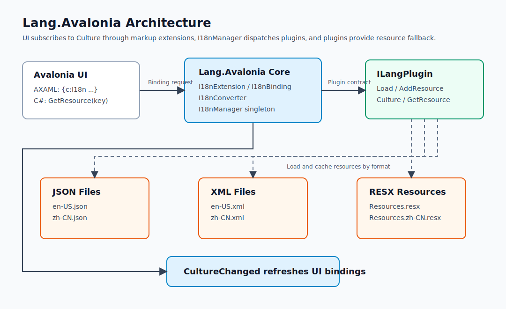
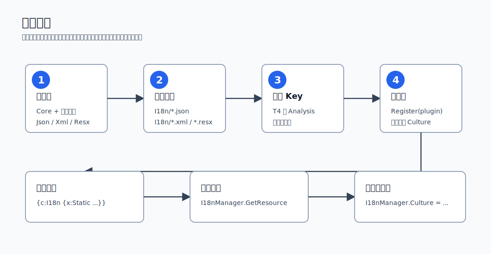
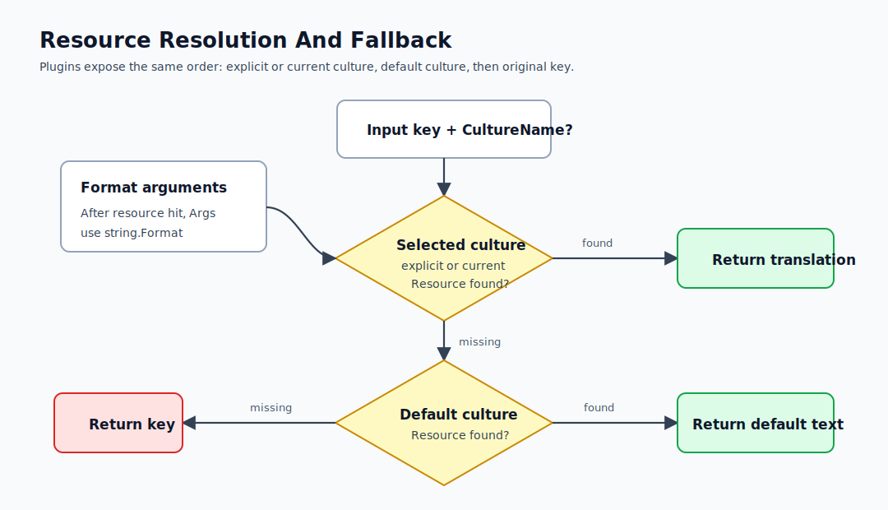
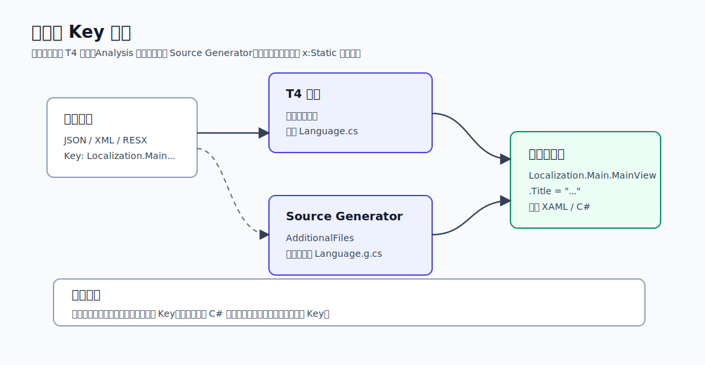

# Lang.Avalonia Technical Notes And Design

[简体中文](design.zh-CN.md) | English

This document is intended for maintainers and integrators. It combines Lang.Avalonia's design goals, core types, plugin contract, resource loading, runtime resolution flow, and demo organization. For quick start, read [README.md](../README.md). Diagrams are stored as standalone SVG files under `docs/assets` so they can be reused in README files, NuGet documentation, or documentation sites.

## Design Goals

Lang.Avalonia provides a unified localization entry point for Avalonia applications: XAML uses the `{c:I18n}` markup extension, C# uses `I18nManager.Instance.GetResource`, and the resource format is selected by the plugin. The core library does not care whether resources come from JSON, XML, or RESX. It only depends on `ILangPlugin`.

The design has two layers:

1. The `Lang.Avalonia` core library handles XAML markup extensions, binding refresh, formatting, and culture switching.
2. JSON, XML, and RESX plugins normalize different resource sources into `LocalizationLanguage` dictionaries.

This design keeps UI, ViewModels, and business code independent from the resource file format. Consumers register one `ILangPlugin`, then read text through `{c:I18n}` or `I18nManager.Instance.GetResource`.



## Packages And Core Types

| Package | Responsibility |
| --- | --- |
| `Lang.Avalonia` | Markup extension, binding pipeline, converters, `I18nManager`, plugin contract |
| `Lang.Avalonia.Json` | Loads JSON language files or embedded JSON resources |
| `Lang.Avalonia.Xml` | Loads XML language files or embedded XML resources |
| `Lang.Avalonia.Resx` | Synchronizes RESX resources through `ResourceManager` |
| `Lang.Avalonia.Analysis` | Scans language files at compile time and generates type-safe keys |

| Type | Package | Purpose |
| --- | --- | --- |
| `I18nManager` | `Lang.Avalonia` | Global runtime entry point for plugin registration, culture switching, and binding refresh |
| `I18nExtension` | `Lang.Avalonia` | AXAML markup extension entry point: `{c:I18n ...}` |
| `I18nBinding` | `Lang.Avalonia` | MultiBinding that listens to Culture, resource keys, and formatting arguments |
| `I18nConverter` | `Lang.Avalonia` | Resolves resources, applies `string.Format`, and performs final value conversion |
| `ILangPlugin` | `Lang.Avalonia` | Plugin contract that hides JSON, XML, and RESX loading differences |
| `JsonLangPlugin` | `Lang.Avalonia.Json` | Scans JSON files or embedded JSON resources |
| `XmlLangPlugin` | `Lang.Avalonia.Xml` | Scans XML files or embedded XML resources |
| `ResxLangPlugin` | `Lang.Avalonia.Resx` | Discovers `ResourceManager` and synchronizes RESX resources |
| `LanguageSourceGenerator` | `Lang.Avalonia.Analysis` | Generates type-safe resource keys from `AdditionalFiles` |

## Plugin Contract

Plugins implement `ILangPlugin` and normalize language resources from different sources into `LocalizationLanguage` caches. The core library calls `Load` to initialize the default language, uses `Culture` to switch languages, and calls `GetResource` to resolve translated text.


Key constraints:

1. `Load(defaultCulture)` should set the default language and build the resource cache.
2. `AddResource(assemblies)` should append resources from external modules. JSON/XML plugins can read embedded resources, and the RESX plugin discovers `ResourceManager` from assembly types.
3. `GetResource(key, cultureName)` should use the explicit culture first; if it is not provided, use the current culture; then fall back to the default culture; if still missing, return the original key.

## Usage Flow

Consumers choose a resource format and install the corresponding plugin, create language resources, generate type-safe keys, register the plugin in `App.Initialize`, and then read resources from XAML or C#.



Typical initialization:

```csharp
I18nManager.Instance.Register(new JsonLangPlugin(), new CultureInfo("zh-CN"), out var error);
if (!string.IsNullOrWhiteSpace(error))
{
    // Log or show the initialization error.
}
```

Typical XAML:

```xml
<SelectableTextBlock Text="{c:I18n {x:Static mainLangs:MainView.Title}}" />
<SelectableTextBlock Text="{c:I18n {x:Static mainLangs:MainView.Title}, CultureName=en-US}" />
```

Typical C# call:

```csharp
var title = I18nManager.Instance.GetResource(Localization.Main.MainView.Title);
var titleEnUs = I18nManager.Instance.GetResource(Localization.Main.MainView.Title, "en-US");
```

## Runtime Resolution

1. The application calls `I18nManager.Instance.Register(plugin, defaultCulture, out error)` on startup.
2. The plugin runs `Load(defaultCulture)` and builds its resource cache.
3. `I18nManager` synchronizes the current and default thread `CurrentCulture` / `CurrentUICulture`.
4. `{c:I18n}` bindings in AXAML listen to `I18nManager.Culture`.
5. When `Culture` changes, all bindings re-query resources through the plugin.
6. Plugins fall back from explicit culture, current culture, default culture, and finally the original key.

`I18nConverter` listens to `I18nManager.Culture`. When the language changes, bindings are re-evaluated and resources are resolved through the active plugin. Text with arguments uses `string.Format(culture, format, args)`. If binding arguments are not ready, the current value is kept to avoid startup binding exceptions.



Fallback order:

1. Explicit `CultureName`, or `I18nManager.Culture` when omitted.
2. The default culture passed during initialization.
3. The original resource key.

## Resource Formats

### JSON Resources

JSON files are useful when language files should remain editable or be processed by external tools. Each file must provide the `language`, `description`, and `cultureName` metadata fields:

```json
{
  "language": "English",
  "description": "English resources",
  "cultureName": "en-US",
  "Localization": {
    "Main": {
      "MainView": {
        "Title": "Lang.Avalonia localization workspace"
      }
    }
  }
}
```

The plugin expands leaf nodes into dot-separated keys, for example `Localization.Main.MainView.Title`. Project files should copy JSON resources to the output directory:

```xml
<ItemGroup>
  <None Update="I18n\*.json" CopyToOutputDirectory="PreserveNewest" />
</ItemGroup>
```

### XML Resources

XML files are suitable when resource hierarchy should be explicit. The root node stores language metadata and leaf nodes store resource values:

```xml
<?xml version="1.0" encoding="utf-8"?>
<Localization language="English" description="English resources" cultureName="en-US">
  <Main>
    <MainView>
      <Title>Lang.Avalonia localization workspace</Title>
    </MainView>
  </Main>
</Localization>
```

XML files also need to be copied to the output directory:

```xml
<ItemGroup>
  <None Update="I18n\*.xml" CopyToOutputDirectory="PreserveNewest" />
</ItemGroup>
```

### RESX Resources

RESX files use the standard .NET `ResourceManager` mechanism. Resource names should use full keys:

```xml
<data name="Localization.Main.MainView.Title" xml:space="preserve">
  <value>Lang.Avalonia localization workspace</value>
</data>
```

`ResxLangPlugin` can use an explicit `ResourceManager`, which is the recommended path for trimmed publishing:

```csharp
new ResxLangPlugin(Resources.ResourceManager)
```

It can also use the generated resource designer type. The constructor parameter is annotated so the designer type's static properties are preserved by the trimmer:

```csharp
new ResxLangPlugin(typeof(Resources))
```

Convention-based discovery scans loaded assemblies for generated resource designer types and reads their `ResourceManager` properties. This path is kept for compatibility. The default `Mark` is `i18n`; if a project resource name does not include `I18n`, set it explicitly:

```csharp
new ResxLangPlugin { Mark = "Resources" }
```

## Type-Safe Key Generation

The project supports two paths for generating type-safe keys: T4 templates in demo projects and the `Lang.Avalonia.Analysis` Source Generator. Both generate constants for `x:Static` and avoid hardcoded strings. Field names may be sanitized to produce valid C# identifiers, but field values must preserve the original resource keys or runtime lookup will fail.



Source Generator inputs come from `AdditionalFiles`:

```xml
<ItemGroup>
  <PackageReference Include="Lang.Avalonia.Analysis" Version="*" PrivateAssets="all" />
  <AdditionalFiles Include="I18n\*.json" />
</ItemGroup>
```

Generated shape:

```csharp
namespace Localization.Main;

public static class MainView
{
    public static readonly string Title = "Localization.Main.MainView.Title";
}
```

Generated keys are used from XAML:

```xml
<SelectableTextBlock Text="{c:I18n {x:Static mainLangs:MainView.ChangeLanguage}}" />
```

## AXAML And C# Usage

```xml
xmlns:c="https://codewf.com"
xmlns:mainLangs="clr-namespace:Localization.Main"

<SelectableTextBlock Text="{c:I18n {x:Static mainLangs:MainView.Title}}" />
<SelectableTextBlock Text="{c:I18n {x:Static mainLangs:MainView.Title}, CultureName=en-US}" />
<SelectableTextBlock Text="{c:I18n {x:Static mainLangs:MainView.RunningCountInfo}, {Binding RunningCount}}" />
<SelectableTextBlock Text="{c:I18n {Binding SelectedResourceKey}}" />
```

Formatting arguments can be constants or Avalonia bindings. Dynamic keys can also come from bindings.

```csharp
var title = I18nManager.Instance.GetResource(Localization.Main.MainView.Title);
var titleEnUs = I18nManager.Instance.GetResource(Localization.Main.MainView.Title, "en-US");

I18nManager.Instance.Culture = new CultureInfo("ja-JP");
```

## Demo Projects

The current demos use a localization workspace scenario instead of a single-button or simple-text sample:

| Demo | Coverage |
| --- | --- |
| `Lang.Avalonia.Json.Demo` | JSON file scanning, T4 keys, runtime language switching |
| `Lang.Avalonia.Xml.Demo` | XML leaf-node parsing, T4 keys, fixed-culture preview |
| `Lang.Avalonia.Resx.Demo` | RESX Designer, ResourceManager, satellite resources |
| `Lang.Avalonia.Analysis.Demo` | JSON resources, `AdditionalFiles`, Source Generator |

Demo ViewModels use non-null language lists and switch `I18nManager.Instance.Culture` only after validating the selected language. This avoids null references when resources are not loaded or the ComboBox selection is cleared.

## Runtime And Maintenance Notes

1. JSON/XML plugins scan `AppDomain.CurrentDomain.BaseDirectory` by default. Demo projects copy language files through `CopyToOutputDirectory`.
2. The RESX plugin filters resource types by `Mark`; the default value is `i18n`, so resource namespaces should include this marker or set `Mark` explicitly.
3. `I18nManager.Register` synchronizes the current thread culture and the default thread culture, so newly created background threads inherit the default culture.
4. JSON/XML providers and explicitly registered RESX resources do not require a Root.xml file from consumers for Lang.Avalonia packages.
5. Convention-based RESX discovery uses reflection and is not the recommended path for trimmed apps; use `new ResxLangPlugin(Resources.ResourceManager)` or `new ResxLangPlugin(typeof(Resources))`.
6. Dynamic key binding depends on Avalonia `Binding`; trimmed applications should still pay attention to Avalonia reflection-binding trim warnings.
7. Demo publish profiles may keep a TrimmerRoots.xml for demo application or third-party framework types; that file is application-specific and is not required by Lang.Avalonia NuGet packages.
8. Add XML documentation comments when adding public APIs.
9. Implement `ILangPlugin` for new resource formats; do not push format branching into the core library.
10. Keep demo resources and generated constants synchronized so XAML `x:Static` references remain valid.
11. Documentation examples should use the current `Localization.Main.MainView` resource structure and avoid historical business keys.
12. When updating SVG diagrams, render them in a browser and check arrow endpoints and text overlap.
